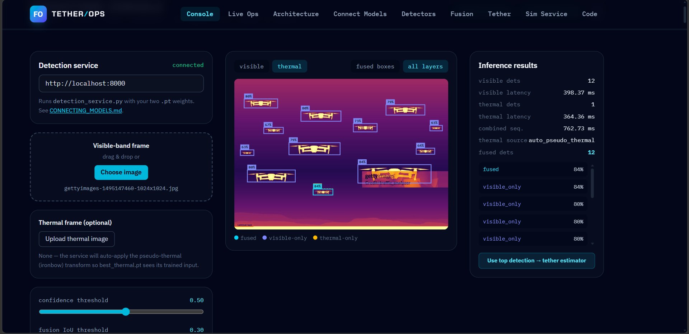
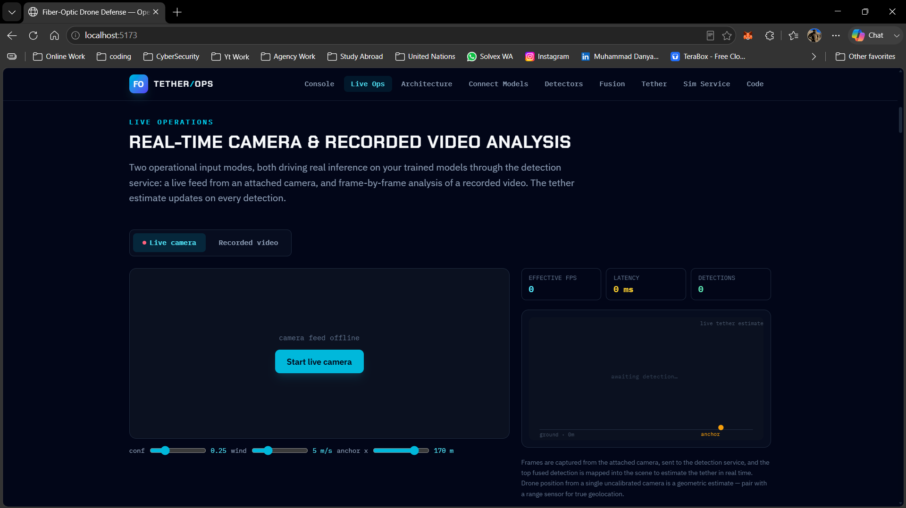
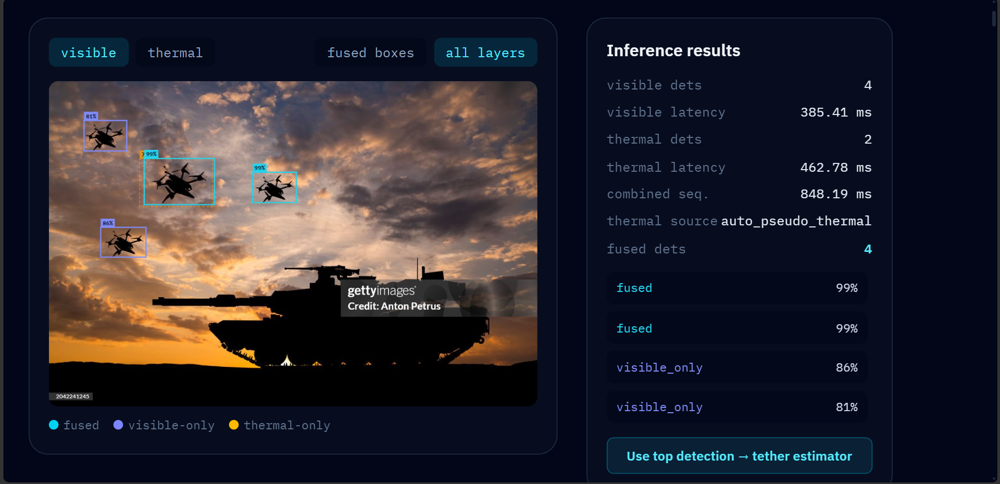
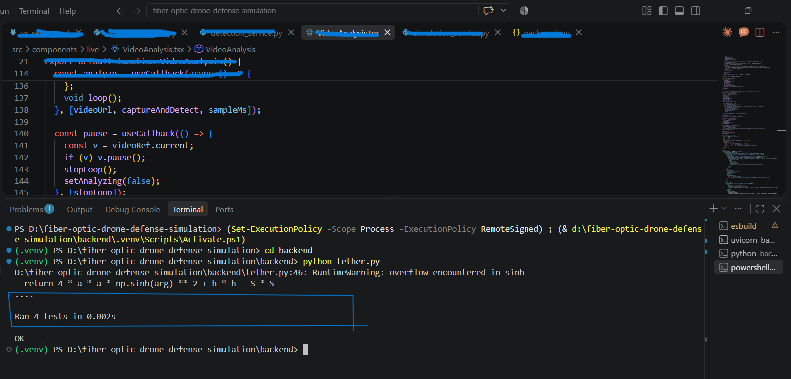
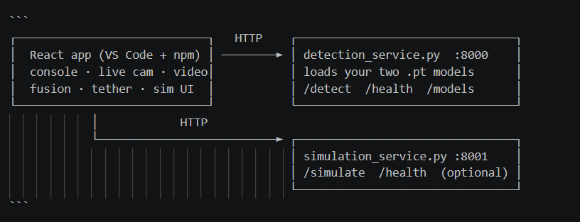
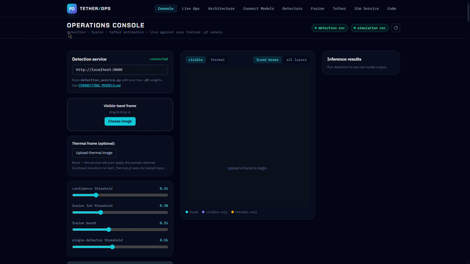
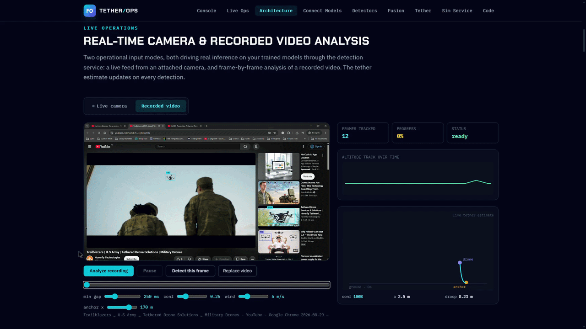

<div align="center">

# 🛡 Fiber-Optic Drone Defense — Research Framework

### Detect · Track the tether — entirely in software

**A software-only research prototype for detecting, fusing, and geometrically
tracking tethered (fiber-optic) drones - detection, cross-modal fusion,
catenary tether estimation, and an engagement simulator, all without hardware.**

**This is a public preview.** The full source code is proprietary and private.

[](LICENSE)
[](https://www.python.org)
[](https://nodejs.org)
[](https://fastapi.tiangolo.com)
[](https://react.dev)

[Preview Gallery](#Preview-Gallery) · [Overview](#overview) · [Architecture](#architecture) · [Features](#Features) · [Usage](#usage) · [License](#license)


</div>

---
## 📸 Preview Gallery

> Add our screenshots to an `assets/` folder next to this README, using the
> exact filenames below (checklist at the bottom).

<div align="center">

| | |
|---|---|
|  |  |
| *Operations Console - fused + per-model boxes* | *Live camera - real-time detection & tether* |
|  |  |
| *Analyzed Image - altitude track & per-frame tether* | *Tether file running & testing result* |
|  |  |
| *Engagement simulator dashboard* | *What we are setting Up?* |

</div>
---

## 📸 Videos Gallery

> Add our videos to an `gifs/` folder next to this README, using the
> exact filenames below (checklist at the bottom).

<div align="center">

| | |
|---|---|
|  |  |
| *Full Dashboard Preview From Start to End* | *Live Testing — real-time detection & tether* |
| 
| *Engagement simulation Testing* |

</div>
---

> **⚠ PROPRIETARY — ALL RIGHTS RESERVED.** This repository is protected by a
> restrictive license. **We may not use, copy, modify, or distribute it
> without prior written permission from the copyright holder.** See
> [LICENSE](LICENSE) for the full terms and the consequences of unauthorized
> use.

> **🕊 Software-only research tool.** This project performs object detection,
> sensor fusion, and geometric simulation **in software only**. It does not
> control, aim, or operate any real hardware, laser, or interceptor, and it is
> not instructions for building one.

---

## Overview

Small fiber-optic-tethered drones are hard to detect: the cable is thin and the
airframe is small. This framework is a **research prototype** that models the
full defensive pipeline in simulation:

1. **Two computer-vision detectors** — YOLOv8-medium trained on visible-band
   imagery and on a documented pseudo-thermal (ironbow) transform of the same
   imagery, with realistic urban negatives mined to suppress ground clutter.
2. **Cross-modal fusion** — a simple, inspectable rule that boosts confidence
   when both detectors agree on a region and applies a stricter bar to
   single-modality detections.
3. **Tether estimation** — a NumPy/SciPy catenary model of the trailing fiber
   cable with a documented lateral wind-deflection term.
4. **Engagement simulator** — a Monte-Carlo scorer for idealized
   geometric/control-loop interception outcomes under varying speed and wind.

Everything runs on **free-tier resources**: a single GPU for training and a
CPU for the services and simulation.

## Architecture

```
┌────────────────────────────────┐   HTTP    ┌──────────────────────────────┐
│  React operations console      │ ────────► │ detection_service.py  :8000  │
│  frame inspector · live camera │           │ loads our two .pt models    │
│  recorded video · tether · sim │           │ /detect  /health  /models    │
└────────────────────────────────┘           └──────────────────────────────┘
            │            HTTP
            └──────────────────────────► ┌──────────────────────────────────┐
                                         │ simulation_service.py  :8001     │
                                         │ /simulate  /health   (optional)  │
                                         └──────────────────────────────────┘
```

- **Frontend** — React + Vite + Tailwind. The interactive operations console:
  image inspection, live camera, recorded-video analysis, live tether, and the
  simulation dashboard.
- **Detection microservice** — FastAPI + `ultralytics`. Loads our two trained
  YOLOv8-medium `.pt` checkpoints, applies the pseudo-thermal transform when
  needed, and returns per-model detections plus the fused result.
- **Simulation microservice** — FastAPI. Optional; the app falls back to an
  in-browser simulation when it is offline.

## Features

- 🖼 **Frame inspector** — run both models + fusion on any uploaded image, with
  fused / per-model bounding boxes and real latencies.
- 🎥 **Live camera** — real-time detection from an attached camera with a live
  tether estimate, effective FPS, and latency readout.
- 📼 **Recorded video** — frame-by-frame analysis with an altitude track
  timeline and per-frame tether, plus single-frame scrub-and-detect.
- 🪢 **Catenary tether model** — with unit tests against a known analytic
  catenary and a documented wind-droop term.
- 📊 **Engagement simulator** — kinetic + laser scoring by speed/wind bucket,
  exportable to CSV/JSON.
- 🔌 **Microservices** — detection and simulation run as independent services
  with health endpoints.

## Tech Stack

| Layer | Technology |
|-------|-----------|
| Frontend | React 18, Vite, TypeScript, Tailwind CSS, Recharts |
| Detection service | Python, FastAPI, Uvicorn, Ultralytics (YOLOv8), OpenCV |
| Simulation service | Python, FastAPI, NumPy, SciPy, pandas |
| Models | YOLOv8-medium (`.pt` checkpoints we train) |


## Usage

| Panel | What it does |
|-------|-------------|
| **Operations Console** | Upload a frame → **Run Detection** → fused + per-model boxes, counts, latencies |
| **Live Ops → Live camera** | Stream an attached camera, detect in real time, live tether |
| **Live Ops → Recorded video** | Analyze a recording frame-by-frame, build the altitude track |
| **Tether** | Interactive catenary + wind-droop explorer with unit tests |
| **Sim Service** | Run engagement trials (service or in-browser), view charts, export results |


## Project Structure

```
├─ src/                    # React app
│  ├─ lib/                 # fusion, catenary, simulation, API client
│  └─ components/          # console, live ops, tether, dashboard
├─ backend/
│  ├─ detection_service.py # :8000 — loads our .pt models
│  ├─ simulation_service.py# :8001 — engagement simulator
│  ├─ serve.py             # one-command launcher
│  ├─ requirements.txt
│  └─ models/              # ⚠ our .pt checkpoints (not committed)
├─ CONNECTING_MODELS.md    # model-connection reference
├─ vs_setting.md           # full VS Code setup walkthrough
├─ README.md
├─ LICENSE                 # All Rights Reserved
├─ CONTRIBUTING.md
└─ SECURITY.md
```

## Ethical Use & Scope

This is a **defensive, software-only research tool**. It performs computer
vision and geometric simulation. It does **not** validate real hardware, real
sensors, or real-world interception physics, and it is **not** an interface to,
or instructions for, any weapon, laser, or interceptor. Users must comply with
all applicable laws and export-control regulations.

## License

> **All Rights Reserved - Proprietary.** This preview describes a closed-source
> project. The source code, model weights, and documentation are **not**
> licensed for use, copying, modification, or distribution.

- 🔒 The **full source code is private** and is not included in this repository.
- 📄 Use of any part of the project requires **prior written permission**.
- ✉️ To request access or a license, contact, Read the full [LICENSE](LICENSE). For permission requests, contact the
copyright holder.
- ⚖️ Unauthorized use is prohibited and may be pursued legally - see the
  project's full license in the private repository.

---

<div align="center">
<sub>Research prototype · Simulation & machine learning only · © 2026 — All rights reserved</sub>
</div>
